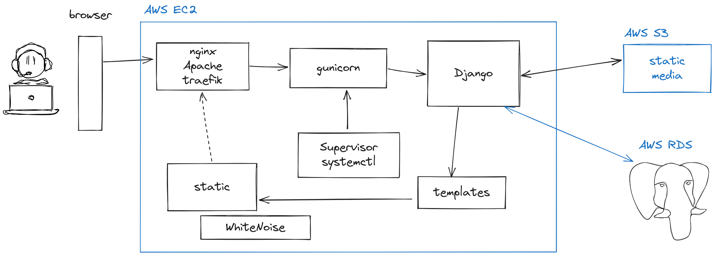
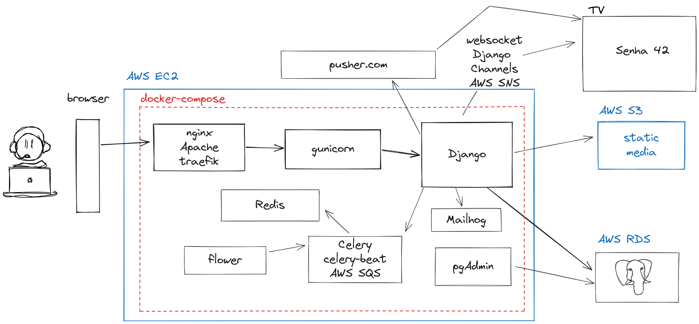

# django-deploy

Estudo sobre como fazer o deploy de uma app Django.

## Servidor local do Python

No Python nós temos um servidor bem simples onde podemos rodar uma página web na porta local.

```
python -m http.server
```

Ele vai renderizar o arquivo `index.html` em localhost:8000


## Servidor local do Django

No Django também temos um servidor local.

```
python manage.py runserver
```


## Deploy em produção

A seguir temos um esboço do que podemos usar para fazer o nosso deploy em produção.






## Servidor de aplicação

### [Gunicorn](https://gunicorn.org/)


## Proxy Reverso

https://www.nginx.com/

https://traefik.io/traefik/


## PaaS

* [fly.io](https://fly.io/)
* [render.com](https://render.com/)
* [vercel](https://vercel.com/)
* [pythonanywhere](https://www.pythonanywhere.com/)
* [railway.app](https://railway.app/)
* [huggingface.co](https://huggingface.co/)
* [AWS Elastic Beanstalk](https://aws.amazon.com/pt/elasticbeanstalk/)


## Serviços Externos

### [pusher.com](https://pusher.com/)

É um serviço de mensageria Pub/Sub. Ele notifica em tempo real todos os inscritos num canal pré-definido.

#### Exemplos de uso:

* chat
* notificação, exemplo TV que informa a senha do próximo cliente a ser atendido


### [Nginx Proxy Manager](https://nginxproxymanager.com/)

Expõe os serviços da aplicação de uma forma fácil e segura.


## Serviços interessantes com Docker

### [Portainer](https://www.portainer.io/)

É um gerenciador de containers com interface web.

```
# Portainer
docker run -d \
--name myportainer \
-p 9000:9000 \
--restart always \
-v /var/run/docker.sock:/var/run/docker.sock \
-v /opt/portainer:/data \
portainer/portainer
```

### [Mailhog](https://github.com/mailhog/MailHog)

É um serviço de e-mail para testes locais.

```
# docker-compose.yml
  mailhog:
    container_name: dicas_de_django_mailhog
    image: mailhog/mailhog
    restart: always
    logging:
      driver: 'none'
    ports:
      - 1025:1025
      - 8025:8025
    networks:
      - dicas-de-django-network
```


### [pgAdmin](https://www.pgadmin.org/download/)

É um serviço que serve para gerenciar os bancos de dados em PostgreSQL.

```
# docker-compose.yml
  pgadmin:
    container_name: dicas_de_django_pgadmin
    image: dpage/pgadmin4
    restart: unless-stopped
    volumes:
       - pgadmin:/var/lib/pgadmin
    environment:
      PGADMIN_DEFAULT_EMAIL: admin@admin.com
      PGADMIN_DEFAULT_PASSWORD: admin
      PGADMIN_CONFIG_SERVER_MODE: 'False'
    ports:
      - 5051:80
    networks:
      - dicas-de-django-network
```


### [Celery](https://docs.celeryq.dev/en/latest/)

É um sistema de gerenciamento de filas de tarefas assíncrona.

